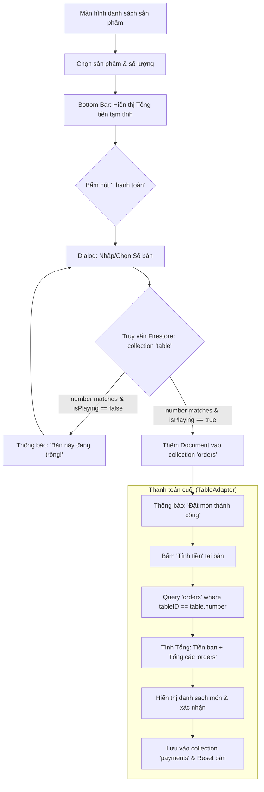

# Sơ đồ luồng Usecase: Đặt đồ ăn cho bàn (Billiards Management)

Tài liệu này mô tả quy trình nghiệp vụ dựa trên cấu trúc Firestore thực tế của dự án.

## 1. Sơ đồ Mermaid

## 2. Cấu trúc Firebase thực tế (Cập nhật)

Dựa trên dữ liệu hệ thống, cấu trúc các collection được quy định như sau:

### 2.1. Collection `table` (Thông tin bàn)
| Trường | Kiểu dữ liệu | Mô tả |
| :--- | :--- | :--- |
| `id` | String | ID định danh (ví dụ: "table_01") |
| `number` | Number | Số bàn (dùng để liên kết đơn hàng) |
| `isPlaying` | Boolean | Trạng thái (true: đang có khách, false: bàn trống) |
| `startTime` | Number | Thời gian bắt đầu chơi (timestamp) |

### 2.2. Collection `orders` (Món ăn đã gọi)
| Trường | Kiểu dữ liệu | Mô tả |
| :--- | :--- | :--- |
| `tableID` | Number | Số bàn gọi món (khớp với `number` của collection `table`) |
| `price` | Number | Đơn giá sản phẩm |
| `quantity` | Number | Số lượng đặt |
| `productName` | String | (Nên bổ sung) Tên món ăn để hiển thị trong danh sách |

### 2.3. Collection `payments` (Lịch sử hóa đơn)
| Trường | Kiểu dữ liệu | Mô tả |
| :--- | :--- | :--- |
| `id` | String | ID hóa đơn |
| `table` | Number | Số bàn thanh toán |
| `price` | Number | Tổng số tiền (Bàn + Món) |
| `time` | Number | Thời điểm thanh toán |
| `timePlay` | Number | Tổng thời gian chơi (phút hoặc ms) |

### 2.4. Collection `users` (Nhân viên/Quản lý)
- `email`: Email đăng nhập.
- `name`: Tên hiển thị.
- `role`: Vai trò (ví dụ: "staff").

## 3. Quy trình xử lý dữ liệu

1.  **Kiểm tra bàn:** Trước khi lưu vào `orders`, ứng dụng phải tìm document trong `table` có `number` trùng với số bàn khách nhập. Nếu `isPlaying` là `false`, chặn không cho đặt món.
2.  **Lưu đơn hàng:** Mỗi món ăn được tạo thành 1 document trong `orders`.
3.  **Thanh toán:**
    - Lấy `startTime` từ `table` để tính tiền giờ.
    - `db.collection("orders").whereEqualTo("tableID", tableNumber).get()` để lấy danh sách món.
    - Hiển thị danh sách món + tiền giờ lên màn hình thanh toán.
    - Sau khi xác nhận, lưu dữ liệu tổng hợp vào `payments` và cập nhật `table` về trạng thái `isPlaying: false`.
